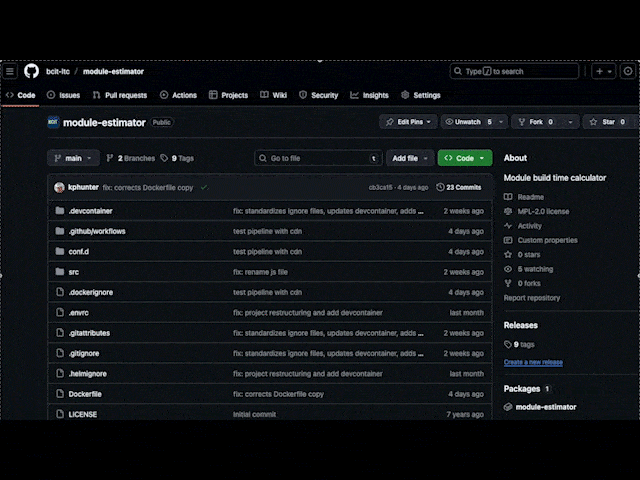
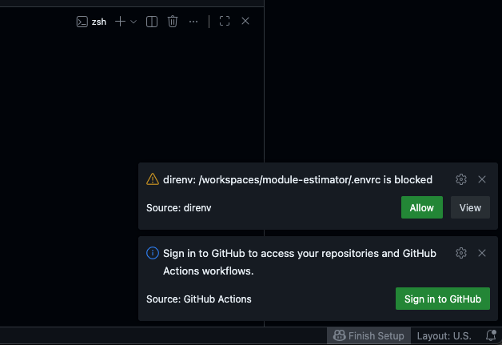
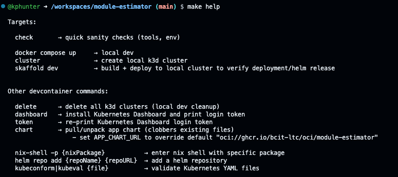
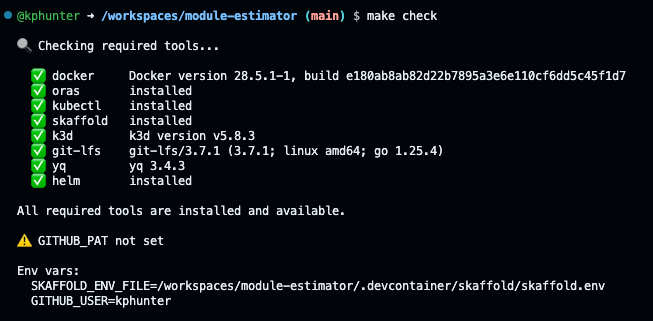

<!-- markdownlint-disable code-block-style -->
# Codespace development

Instead of installing various command line tools and libraries locally, sometimes it is more convenient to login to a web-based dev environment that is pre-configured. [`devcontainers`](https://containers.dev/)[^1] using [GitHub Codespaces](https://github.com/features/codespaces)[^2] are one such option.


/// caption
Creating a new GitHub Codespace
///

## Configuring a devcontainer

GitHub Codespaces reads a `.devcontainer/devcontainer.json` to initialize a hosted development environment. In addition to a `.devcontainer` folder, `.envrc`, `Makefile`, and various `.ignore` files add helpers and conveniences that facilitate verification and testing. A typical repository might look something like this:

``` shell  hl_lines="8-10 13 14 17"
.
├── .devcontainer # (1)!
│   ├── devcontainer.json
│   ├── k3d
│   ├── scripts
│   ├── skaffold
│   └── test
├── .dockerignore
├── .envrc
├── .gitattributes
├── .github
│   └── workflows
├── .gitignore
├── .helmignore
├── Dockerfile
├── LICENSE
├── Makefile
├── README.md
├── conf.d
│   └── default.conf
├── docker-compose.yml
├── index.js
├── package.json
├── public
│   ├── favicon.ico
│   └── index.html
└── src
    ├── App.jsx
    ├── assets
    ├── calculators
    ├── components
    ├── helpers
    └── style.css

```

1. :sparkles: Required

To create a codespace:

1. Select the green "Code" button from the main GitHub repository page
2. Select the :lucide-ellipsis: to the right of "Codespaces" and choose :lucide-plus: "New with options..."
3. If you want a faster Codespace, change the machine type. Otherwise, click the green "Create codespace" button

## Using Codespaces

### Finishing setup

When you first launch a Codespace there will be pop-ups in the bottom right. Finish setting up the environment:

1. Allow the `direnv` extension
2. Run `make help` to see available commands
3. Run `make check` to verify readiness

!!! warning "1. Allow the `direnv` extension to configure required environment variables."

    

    **Then, restart the terminal to reload the configuration**

!!! tip "2. Run `make help` to see some of the available commands"

    

!!! tip "3. Confirm the environment is ready with `make check`"

    

### Basic "local" development

Start by testing to make sure the basic `docker compose up` works as expected. If something fails, correct the issue before moving on.

If everything looks good, you can start testing deployment with Skaffold.

## Testing deployment with Skaffold

Containers are deployed to Kubernetes using Helm charts, and Codespaces are a great place to test whether a Helm chart deploys correctly.

### Helm charts

A Helm chart is a set of templated Kubernetes manifests that can be applied to clusters.

### Skaffold

Skaffold is a utility that automates the building and deploying of images.

[^1]: [https://containers.dev/](https://containers.dev/)
[^2]: [https://github.com/features/codespaces](https://github.com/features/codespaces)
