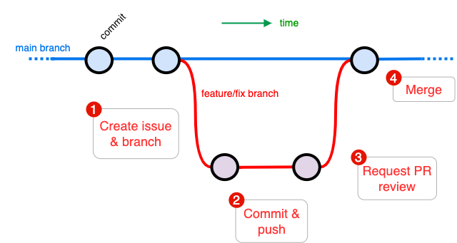

# Git workflow

App development loosely follows [GitHub Flow](https://docs.github.com/en/get-started/using-github/github-flow)[^1], where features and fixes are committed to branches, and then merged to `main` through pull requests (PR).

<!-- /// caption
git workflow
/// -->

!!! tip
    - Commit often using short, descriptive comments.
    - Keep branches short-lived - merge into `main` often

[^1]: [https://docs.github.com/en/get-started/using-github/github-flow](https://docs.github.com/en/get-started/using-github/github-flow)
