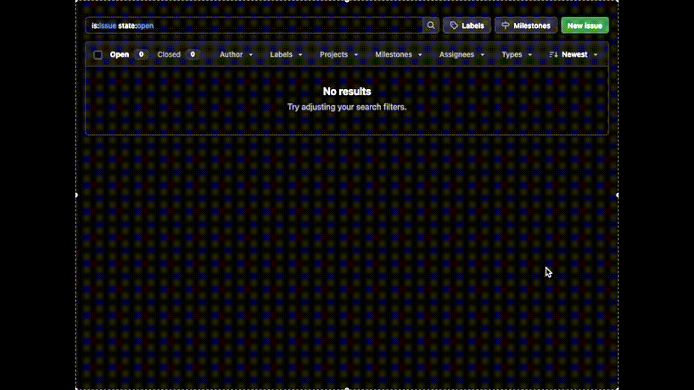
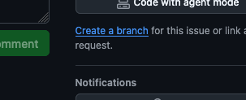
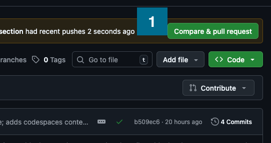

---
tags:
    - git
---
# Git workflow

Our app development process loosely follows the [GitHub Flow](https://docs.github.com/en/get-started/using-github/github-flow)[^1]. Features and fixes are developed on dedicated branches and merged into `main` through pull requests (PRs).

!!! tip

    - Commit early and often, using short, descriptive messages.
    - Keep branches short-lived — merge into `main` regularly.

## Start with an issue

When fixing a bug or starting work on a new feature, begin by **creating a clear, meaningful issue**. This acts as the source of truth for the work and helps others understand the context and goal.

## Create a branch

Next, **create a branch** for your work and check it out in your local IDE.

Commit to your branch frequently to ensure your progress is saved and to make collaboration easier. If you want feedback early, use issue comments and tag teammates using *@username* to get their attention.

## Pull requests & merging

When your branch satisfies the goals of the issue and is ready for integration, **open a pull request** and request a review.

Reviewers may suggest improvements or point out issues by commenting directly on specific lines of code. These discussions appear as threaded comments in the PR.

[^1]: [https://docs.github.com/en/get-started/using-github/github-flow](https://docs.github.com/en/get-started/using-github/github-flow)
