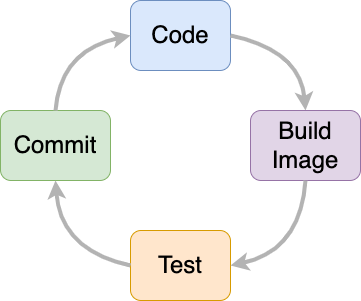

---
tags:
    - Docker
---
<!-- markdownlint-disable code-block-style -->
# Local development

!!! tip "Strategy"

    Rather than building every functional component into one large monolith, build smaller apps that have one purpose and connect them together in a microservice architecture.

Local development involves coding, building an image, running tests, and then committing changes to a branch.


///caption
A container-based "dev loop"
///

We use [Docker](https://docs.docker.com/get-started/)[^1] to:

- run local dev environments using the `docker compose` command
- build development images
- run tests and other container commands
- scan images for vulnerabilities

Docker makes it easy to develop containerized apps by providing a tool stack that builds and runs images on various platforms. Building a containerized app is pretty easy! Usually all you have to do is look for a good base image in [Docker Hub](https://hub.docker.com/)[^2] and configure a `Dockerfile` to copy your code into the image.

## The `Dockerfile`

The main configuration file for Docker images is the `Dockerfile`, a file that specifies how an app should be built. The `Dockerfile` is a sequence of commands that the build engine reads to create everything your app needs to run. The final output of the build is an `image` that can (generally) run on any machine.

``` yaml title="Example Dockerfile" hl_lines="6 10"
#-- Build --#
FROM node:24.6.0-alpine3.22 AS builder

WORKDIR /app

COPY package.json ./

RUN npm install

COPY . /app

RUN npm run build
...
```

For more information about options and best-practices about how to build a `Dockerfile`, see the [`Dockerfile` reference documentation](https://docs.docker.com/engine/reference/builder/)[^3].

## `docker-compose.yml`

When you install Docker, the package includes a command that creates a local dev environment to simulate how microservices can run together. The `docker compose` command reads the configuration specified in a `docker-compose.yml` file and then launches services based on that configuration.

When developing locally, you can configure environment variables, secrets, volumes, networks, and other services inside a `docker-compose.yml`, alongside a framework runtime like a Python `runserver`, or a NodeJS dev server.

!!! tip

    See [Docker Compose – What is It, Example & Tutorial](https://spacelift.io/blog/docker-composes)[^4] for a good overview of how `docker-compose.yml` files work.

!!! example "Example `docker-compose.yml`"

    ```
    # Use postgres/example for user/password credentials
    name: postgres

    services:

      db:
        image: postgres
        restart: always
        environment:
          POSTGRES_PASSWORD: example

      adminer:
        image: adminer
        restart: always
        ports:
          - 8080:8080
    ```

When you have a `Dockerfile` and a `docker-compose.yml` in your project root, run `docker compose up` to launch a local development environment.

[^1]: [https://docs.docker.com/get-started/](https://docs.docker.com/get-started/)
[^2]: [https://hub.docker.com/](https://hub.docker.com/)
[^3]: [https://docs.docker.com/engine/reference/builder/](https://docs.docker.com/engine/reference/builder/)
<!-- markdownlint-disable-next-line -->
[^4]: [https://spacelift.io/blog/docker-composes](https://spacelift.io/blog/docker-composes)
