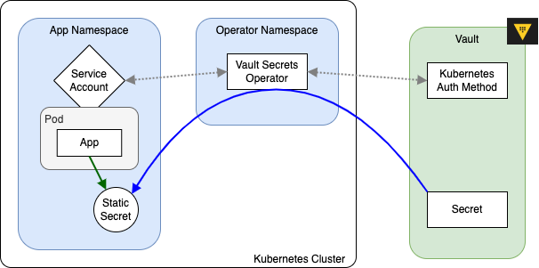

---
tags:
    - Vault
    - VSO
    - values.yaml
---
<!--markdownlint-disable no-inline-html code-block-style -->
# Connecting apps

Vault is the authoritative source for secrets, but how do apps running on Kubernetes clusters retrieve these secrets, especially if the app needs to authenticate to Vault to retrieve the secret?

This "chicken-and-egg" problem is solved by the [Vault Secrets Operator](https://developer.hashicorp.com/vault/docs/deploy/kubernetes/vso)[^1] (VSO), a service that is configured when the cluster is created to help synchronize:

**Kubernetes secrets :lucide-arrow-right-left: Vault secrets**.
/// caption
///

## Overview

Vault Secrets Operator is configured to authenticate with Vault so that it can act on behalf of apps to request secrets. VSO mediates authorization through **Service Accounts**, and then creates secrets that the app can consume.



## VSO in practice

From an app's perspective, the only thing that really matters is that it has access to the secrets it needs. This is usually accomplished through the Helm chart, which renders a `Deployment` resource with a projected volume secret.

!!! tip

    Secrets are mounted into pods as files, not as environment variables

### Configuring app secrets

Apps should read files at `/etc/secrets/` (the default `mountPath`) based on the configuration in the Helm chart. A good way to verify that the secrets are being mounted correctly is to launch a terminal on a running container and browse around to see the file structure.

### Configuring Helm charts

The Helm chart `values.yaml` has sections for **secretMounts** that generate corresponding Kubernetes resources with **volumeMounts**:

<div class="grid" markdown>

``` yaml title="Helm chart <code>values.yaml</code> file" hl_lines="6"
...
processor:
...
  # -- volumeMounts to be added as secrets
  # @default -- `[]`
  secretMounts:
    - name: api-key
      secretName: api-key
      mountPath: /etc/secrets
      readOnly: true
      items:
        - key: API_KEY
          path: api-key/API_KEY
...
```

``` yaml title="K8S resource applied to cluster" hl_lines="8"
apiVersion: apps/v1
kind: Deployment
...
spec:
  template:
    spec:
      containers:
        - volumeMounts:
            - name: processor-secrets
              mountPath: "/etc/secrets"
...
      volumes:
        - name: "processor-secrets"
          projected:
            sources:
              - secret:
                  name: "api-key"
                  items:
                    - key: "API_KEY"
                      path: "api-key/API_KEY"
```

</div>

[^1]: [https://developer.hashicorp.com/vault/docs/deploy/kubernetes/vso](https://developer.hashicorp.com/vault/docs/deploy/kubernetes/vso)
