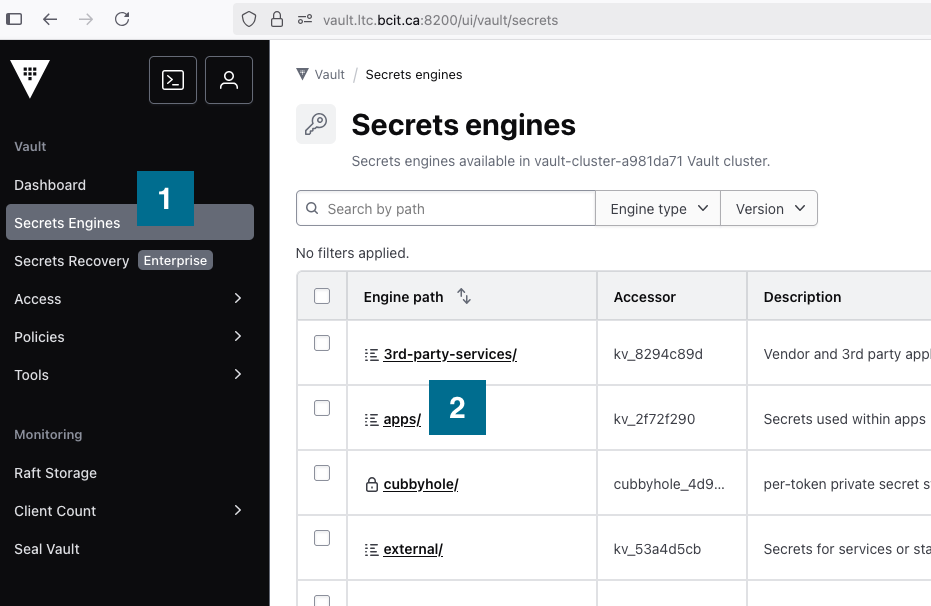
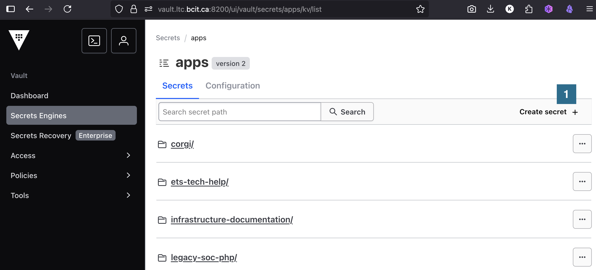
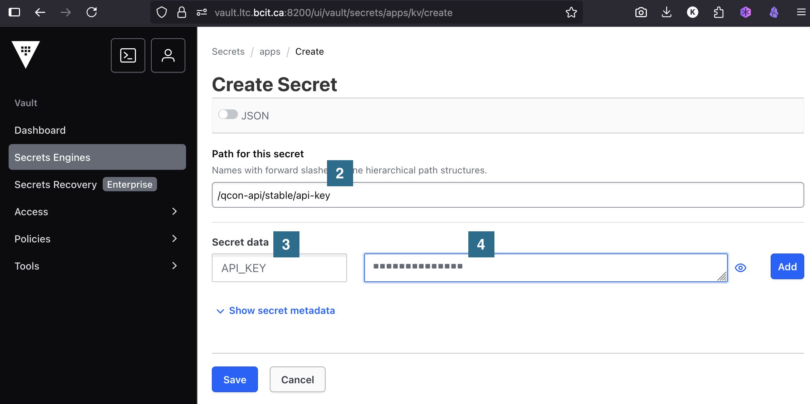

---
tags:
    - Vault
---
<!-- markdownlint-disable code-block-style link-image-reference-definitions -->
# Getting started with secrets

App secrets are a critical part of production services; they are defined as anything that should be protected, and include things like TLS certificates, API tokens, dynamically-generated database credentials, and more.

If an app connects to another app it likely uses a secret to verify its identity (mTLS). If an app needs to perform an action on another app or service, it likely needs to authenticate and be authorized to perform that action (CRUD).

## A simple example

The following Wordpress example[^1] is commonly referenced as a pattern for microservices:

``` yaml title="Docker Hub <code>compose.yaml</code> for Wordpress" linenums="1"
services:

  wordpress:
    image: wordpress
    restart: always
    ports:
      - 8080:80
    environment:
      WORDPRESS_DB_HOST: db
      WORDPRESS_DB_USER: exampleuser
      WORDPRESS_DB_PASSWORD: examplepass
      WORDPRESS_DB_NAME: exampledb
    volumes:
      - wordpress:/var/www/html

  db:
    image: mysql:8.0
    restart: always
    environment:
      MYSQL_DATABASE: exampledb
      MYSQL_USER: exampleuser
      MYSQL_PASSWORD: examplepass
      MYSQL_RANDOM_ROOT_PASSWORD: '1'
    volumes:
      - db:/var/lib/mysql

volumes:
  wordpress:
  db:
```

This example demonstrates how services can use secrets, but it is not offered as a "best-practice" by any stretch!

## Store secrets in Vault

If your application uses any kind of sensitive data, store and retrieve this data from our own hosted version of [Hashicorp Vault](https://www.hashicorp.com/en/products/vault)[^2]. Vault is a secrets management platform, and one of its most useful features is simple key-value pair secret storage.

Vault has a web UI and an API, as well as a convenience command line utility (CLI).

!!! note "Vault service"

    Access our group's hosted web service by browsing to [https://vault.ltc.bcit.ca:8200](https://vault.ltc.bcit.ca:8200)[^3].

??? note "Install the CLI"

    Vault has an API that can be accessed with tools like `curl`, but its easier and more convenient to use the command line tool:

    === ":material-apple: macOS"
        Open up a terminal window and install the `vault` command line utility:

        ``` sh
        brew tap hashicorp/tap
        brew install hashicorp/tap/vault
        ```

    === ":fontawesome-brands-windows: Windows"
        Download, unzip, and install the `vault` binary:

        - [386](https://releases.hashicorp.com/vault/1.21.1/vault_1.21.1_windows_386.zip)
        - [AMD64](https://releases.hashicorp.com/vault/1.21.1/vault_1.21.1_windows_amd64.zip)

    === ":material-linux: Linux"
        Open up a terminal window and run:

        ``` sh
        wget -O - https://apt.releases.hashicorp.com/gpg | sudo gpg --dearmor -o /usr/share/keyrings/hashicorp-archive-keyring.gpg
        echo "deb [arch=$(dpkg --print-architecture) signed-by=/usr/share/keyrings/hashicorp-archive-keyring.gpg] https://apt.releases.hashicorp.com $(grep -oP '(?<=UBUNTU_CODENAME=).*' /etc/os-release || lsb_release -cs) main" | sudo tee /etc/apt/sources.list.d/hashicorp.list
        sudo apt update && sudo apt install vault
        ```

    See alternative installation methods on the [Hashicorp Vault site](https://developer.hashicorp.com/vault/install)[^4].

### Login

1. Login

    Navigate to the [Vault](https://vault.ltc.bcit.ca:8200/ui/vault/auth)[^3] web service and click on the blue "Sign in with Azure" button. Authenticate with your BCIT credentials.

    ??? note "Login with the CLI"

        If you are using the CLI, you can login with the following command:

        ``` shell
        vault login -method=oidc username={yourBcitIdUsername}
        ```

### Add a secret

1. Select the **Secrets Engines :one:** menu item and then select **apps/ :two:**.

    

2. Secrets should be unique for different environments and stored using the following pattern:

    ``` shell
    {mount}/{APP_NAME}/{ENVIRONMENT}/{SECRET_NAME}
    ```

    If, for example, you have the following...

    - secret name: `api-key`
    - secret value: `API_KEY=5JR1K5vyXA38F0`
    - app name: `qcon-web`
    - environment: `stable` environment

    ...you can create a new secret by clicking **Create Secret :one:**

    

    Adding the **Path for this secret :two:**, the **Secret data :three:** key, and the value of the secret **:four:**:

    

    ??? note "Store a secret with the CLI"

        store this secret with the following command:

        ``` shell
        vault kv put -mount="apps" "qcon-web/stable/api-key" API_KEY=5JR1K5vyXA38F0
        ```

See the links in the side menu for additional information about secrets.

[^1]: [https://hub.docker.com/_/wordpress](https://hub.docker.com/_/wordpress)
[^2]: [https://www.hashicorp.com/en/products/vault](https://www.hashicorp.com/en/products/vault)
[^3]: [https://vault.ltc.bcit.ca:8200](https://vault.ltc.bcit.ca:8200)
[^4]: [https://developer.hashicorp.com/vault/install](https://developer.hashicorp.com/vault/install)
