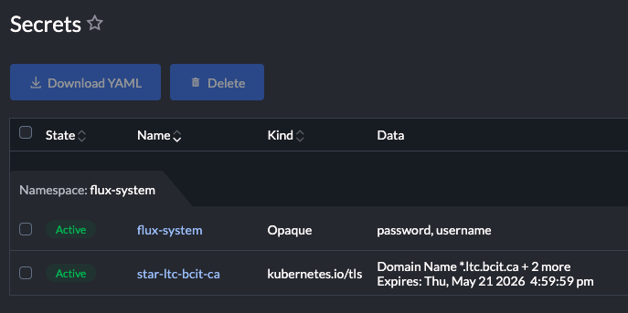

# Types of secrets

Kubernetes has several [types of secrets](https://kubernetes.io/docs/concepts/configuration/secret/#secret-types)[^1]:

| Built-in Type                    | Usage                                 |
| -------------------------------- | -------------------------------------- |
| Opaque                           | arbitrary user-defined data            |
| kubernetes.io/service-account-token | ServiceAccount token                  |
| kubernetes.io/dockercfg          | serialized ~/.dockercfg file           |
| kubernetes.io/dockerconfigjson   | serialized ~/.docker/config.json file  |
| kubernetes.io/basic-auth         | credentials for basic authentication   |
| kubernetes.io/ssh-auth           | credentials for SSH authentication     |
| kubernetes.io/tls                | data for a TLS client or server        |
| bootstrap.kubernetes.io/token    | bootstrap token data                   |

Our work generally deals with only two types: **Opaque** and **kubernetes.io/tls**:

Every app is deployed with a TLS secret to protect the app's main URL (Ingress endpoint).

[^1]: [https://kubernetes.io/docs/concepts/configuration/secret/#secret-types](https://kubernetes.io/docs/concepts/configuration/secret/#secret-types)
