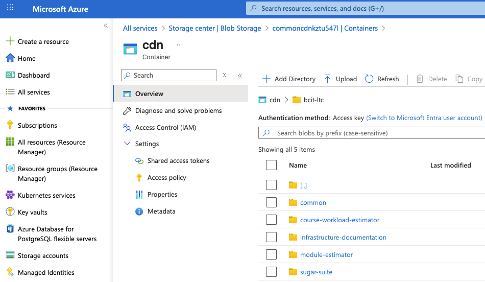
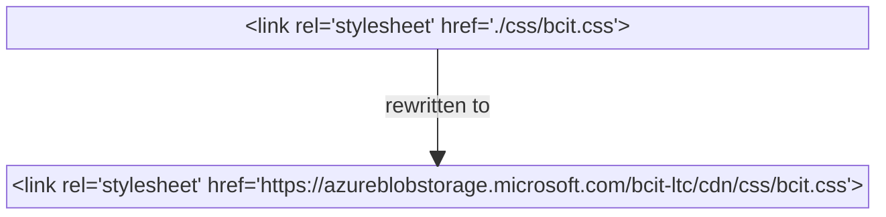

---
tags:
  - storage
  - Azure
  - CDN
  - deployment
  - CI/CD
---
<!-- markdownlint-disable code-block-style link-image-reference-definitions -->
# Azure CDN (Content Delivery Network)

Another concept to note is the use of [Azure Blob Storage](https://learn.microsoft.com/en-us/azure/storage/blobs/storage-blobs-introduction)[^1] as a CDN to store static files.

??? question inline end "What is a CDN?"

    A **C**ontent **D**elivery **N**etwork[^2] is a service that replicates static files across a network of servers around the world to improve page load speed. Popular CDN services include [Akamai Ion](https://www.akamai.com/solutions/edge)[^3], [CloudFlare CDN](https://www.cloudflare.com/en-ca/application-services/products/cdn/)[^4], [AWS CloudFront](https://docs.aws.amazon.com/cloudfront/)[^5], and [Azure FrontDoor](https://learn.microsoft.com/en-us/azure/frontdoor/front-door-overview)[^6].

When we deploy apps, the CI/CD pipeline scans the image for static files and adds them to Azure based on the `APP_NAME`. The CI/CD pipeline script defines default file types that are selected for upload:

``` yaml title="<code>.github/workflows/build-and-push-app.yaml</code>" linenums="44"
# Default asset extensions; can be overridden per-call via inputs.cdn_asset_exts
CDN_ASSET_EXTS_DEFAULT: jpg,jpeg,png,webp,gif,svg,ico,mp4,webm,mp3,ogg,woff,woff2,ttf,otf,css,js,map
```

Files are pushed to the Azure CDN with a path structure that uses an independent `CDN_ASSET_VERSION` value, which is calculated based on a hash of the files when they are selected.


/// caption
Azure Blob Storage file structure
///

The CI/CD pipeline also replaces links to local files with links to the CDN. So for example, in a container running in a cluster, HTML links are transformed like this:



In practice, what this means is that the images pushed to the `ghcr.io` registry (part of the [Deployment](../deploying/index.md) step) will have CDN links rather than relative links to local assets. Images built locally or in a Codespace are not processed by the CI/CD pipeline script, so they retain relative links.

[^1]: [https://learn.microsoft.com/en-us/azure/storage/blobs/storage-blobs-introduction](https://learn.microsoft.com/en-us/azure/storage/blobs/storage-blobs-introduction)
[^2]: [[https://www.cloudflare.com/en-ca/learning/cdn/what-is-a-cdn/](https://www.cloudflare.com/en-ca/learning/cdn/what-is-a-cdn/)]([https://www.cloudflare.com/en-ca/learning/cdn/what-is-a-cdn/](https://www.cloudflare.com/en-ca/learning/cdn/what-is-a-cdn/))
[^3]: [https://www.akamai.com/solutions/edge](https://www.akamai.com/solutions/edge)
[^4]: [https://www.cloudflare.com/en-ca/learning/cdn/what-is-a-cdn/](https://www.cloudflare.com/en-ca/learning/cdn/what-is-a-cdn/)
[^5]: [https://docs.aws.amazon.com/cloudfront/](https://docs.aws.amazon.com/cloudfront/)
[^6]: [https://learn.microsoft.com/en-us/azure/frontdoor/front-door-overview](https://learn.microsoft.com/en-us/azure/frontdoor/front-door-overview)
